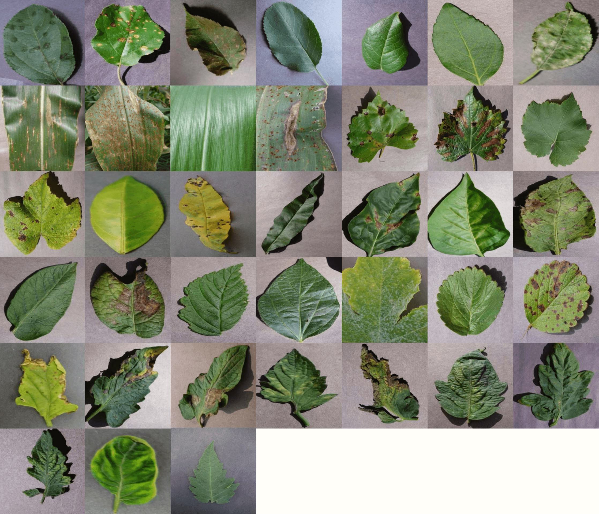

# cnn-plantvillage
   
**Skills Required :** `python`, `pytorch` / `tensorflow` / `caffe`

The task is to train a [Deep Convolutional Neural Network](http://ufldl.stanford.edu/tutorial/supervised/ConvolutionalNeuralNetwork/) to learn to differentiate between
`38` different classes of diseased plant leaves. This is a standard [Image Classification](http://cs231n.github.io/classification/) problem,
and you can find numerous resources on getting started easily on Image Classification on your own dataset.

Some tutorials on training Deep Neural Networks on this dataset are available at :
* https://www.crowdai.org/articles/torch-tutorial-for-plantvillage-challenge
* https://www.crowdai.org/articles/plantvillage-image-classification-tutorial

You can download the dataset from the [crowdAI PlantVillage Disease Classification Challenge](https://www.crowdai.org/challenges/plantvillage-disease-classification-challenge).
And the challenge page has more instructions about the dataset, and the problem definition.

As a solution, you will have to create a repository on [gitlab.crowdai.org](https://gitlab.crowdai.org), which implements an Image Classifier for this dataset.
Please include a description of the problem, your approach, the results (loss+accuracy plots) in the the README of your repository.
Then you can send a pull request by including a link to your repository in the section below.

# Submitted Solutions
* `Link to your solution here`
