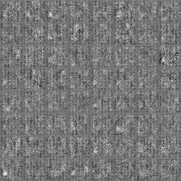

# gan-plantvillage

This task requires you to train Generative Adversarial Networks to generate images similar to the plant village dataset.

For this task, you are required to first download the dataset from the [crowdAI PlantVillage Disease Classification Challenge](https://www.crowdai.org/challenges/plantvillage-disease-classification-challenge). Please focus on just the released `Training Data`.

Then you will have to resize all the images in the dataset from `256x256` to `64x64` pixels. In case of difficulty in getting the models to converge, you can also try with grayscaled version of the dataset.

Then on this minified version of the plantvillage dataset, you are supposed to design and train Generative Adversarial Networks which generate images which look similar to the images in the dataset.

To help you quickly get started on Generative Adversarial Networks, here are some resources :

* https://deeplearning4j.org/generative-adversarial-network
* https://wiseodd.github.io/techblog/2017/01/20/gan-pytorch/
* https://github.com/znxlwm/pytorch-generative-model-collections

As a solution, you will have to create a publicly accessible repository, with an implementation and description of your approach.
**You should also include a link to some generated samples in the README.md of you repository.**

Then you can send a pull request by including a link to your repository in the section below.

# Submitted Solutions
* `Link to your solution here`
